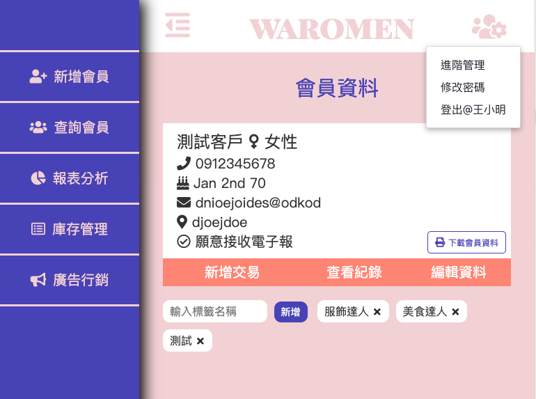

# Waromen

Simple, elegant, the easiest CRM (customer relationship management) to get started.

Visit [our website](https://waromen.herokuapp.com/login).



## Feature

- 後台權限管理系統
- 庫存管理系統
- 自動標籤功能
- 營收分析報表功能
- 支援產品登錄與交易紀錄
- 客製化電子郵件發送
- 會員資料管理系統

### In progress

- 增加會員累積消費後的紅利回饋機制
- 串接 Barcode scanner 的 API，讓結帳更快速
- 串接金流
- 將部分權限認證彈性改為輸入密碼認證
- 自動分析客戶消費紀錄並且發送行銷電郵

## Tests

To run the test suite, first install the dependencies, then run npm test:

```
$ npm install
$ npm init -y
$ npm test
```

## Built With

- [Express](https://expressjs.com/zh-tw/starter/installing.html) - Web framework
- [Handlebars](https://handlebarsjs.com/) - Template engine
- [MySQL](https://www.mysql.com/) - Database
- [Sequelize](http://docs.sequelizejs.com/) - A promise-based Node.js ORM.

## Authors

- XU LI XIAN
- Charlie Chen
- WANG YU ZHEN
